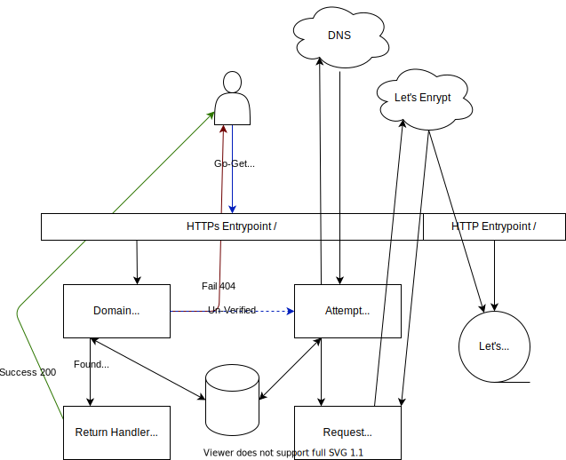

# Go Import Server Documentation

The Go Import Server is a simple HTTP server that supports providing the correct
meta tags for the `go get` command on custom domains.

## Processing Architecture

